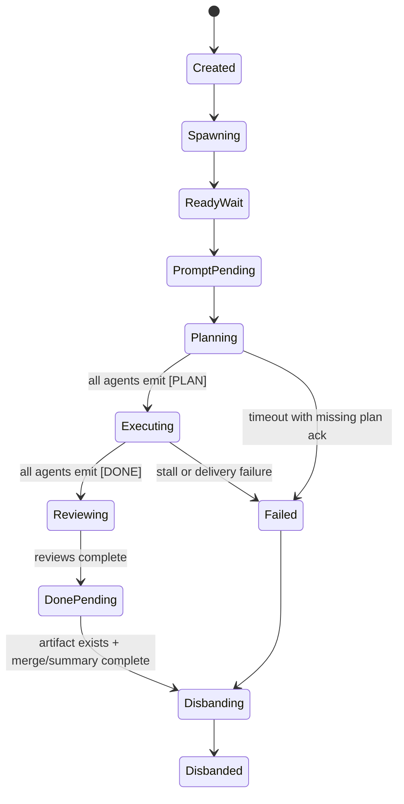

# COLLAB FORENSICS — 2026-04-14

## 1. Scope & Inventory

**Question.** The audit question is not “is ensemble bulletproof?” but: in which concrete state transitions does the current collaboration FSM fail, what is the observable signal, how often did it happen in the trace inventory, and what failed when we tried to disprove it?

**State-machine under test.** `createTeam -> spawn -> waitForReady -> deliverPrompt -> staged plan/exec/verify or freeform loop -> idle/disband`.

**Code reviewed end-to-end.**
- `services/ensemble-service.ts`
- `lib/ensemble-registry.ts`
- `lib/agent-runtime.ts`
- `lib/agent-watchdog.ts`
- `lib/staged-workflow.ts`
- `server.ts`
- Prior context cross-check: [docs/COLLAB_VERDICT_2026-04-14.md](/Users/aimusic/.openclaw/tools/ensemble/docs/COLLAB_VERDICT_2026-04-14.md:1), [docs/COLLAB_VERDICT_2026-04-14_worker_findings.md](/Users/aimusic/.openclaw/tools/ensemble/docs/COLLAB_VERDICT_2026-04-14_worker_findings.md:1)

**Runtime inventory.**
- `236` directories under `/tmp/ensemble`
- `18` `messages.jsonl` traces present
- `15` populated traces
- `3` empty traces
- `218` dirs without `messages.jsonl` at all
- `0` malformed JSONL files in the present `messages.jsonl` set
- Populated trace sizes by line-count: `38/34/26/23/22/20/20/19/14/14/10/5/2/1/1`

**Representative traces sampled directly.**
- Largest/live pathology: `7dc68c69-c386-4f0a-8305-7e581320de52`
- Newest active: `4f3fbbf0-cd8c-4fb5-bfb6-cf4fd5a96d58`
- Large long-lived repeat loop: `5ff51bca-99b3-465c-b2d2-2f647c3ef49e`
- Empty-start failures: `39657e47-92f1-4775-b0db-7bf3153335bb`, `dbe297f0-aa4f-4d94-8261-267418a97c68`, `32aa9329-646c-4c6c-a2d5-4642a6153ae8`
- Thin/no-task traces: `fcdf6b8d-69ae-41b8-bec8-047d4d477be3`, `93a96791-c7e5-4e06-a567-e19a899bc656`

**Observed incidence in the latest 10 populated traces.**
- Narrow `Idle.` literal-signature loops in `3/10` traces: `7dc68c69`, `b137765e`, `4f3fbbf0`
- Broad pathological terminal-loop class (`Idle.`/`Acknowledged`/`Zaključeno.`/`Still working. Latest status unchanged`/verbatim status-stutter) in **`5/10`** traces: `7dc68c69`, `2eebb785`, `5ff51bca`, `c665c98d`, `4f3fbbf0` (reconciled between LEAD and WORKER passes)
- Clean completion in `3/10`: `e53ab84c`, `7f0d961b`, `2debdcb3`
- Aborted short (≤2 msgs) in `2/10`: `fcdf6b8d`, `93a96791`
- Zero `[EXEC_DONE]` markers in `10/10`
- Only the current staged session has `[PLAN_READY]`, meaning the explicit staged markers are not present in historical freeform runs
- Empty or near-empty startup traces in the newest set: `3` empty + `1` two-message status-only trace

## 2. Failure Mode Catalog

### FM1 — Missing terminal state produces literal idle loops
Reproduce:
```bash
nl -ba /tmp/ensemble/7dc68c69-c386-4f0a-8305-7e581320de52/messages.jsonl | sed -n '23,38p'
```
Evidence: trace `7dc68c69`, lines `23-38`, devolves into `Idle.` and `Acknowledged. Stay idle.` after real work completed. Prompt side lacks a terminal artifact requirement; code side lacks a done-state beyond text matching. Relevant code: `services/ensemble-service.ts:136-168`, `lib/staged-workflow.ts:161-223`.
Impact: confirmed in `3/10` latest populated traces and `19` idle-like messages across `4` teams by direct trace inventory.
Disproof attempt: checked whether watchdog or staged workflow enforce silence after completion. They do not. Disproof failed.

### FM2 — Watchdog nudges optimize for chatter, not progress
Reproduce:
```bash
rg -n "Are you still working\\?" lib/agent-watchdog.ts
```
Evidence: `lib/agent-watchdog.ts:10`, `231-249` injects `Are you still working? Share your progress with team-say.` The classifier then treats many analysis/status verbs as progress at `31-50`. This encourages a status reply, which resets idle timers.
Impact: code-level across every active team; trace recurrence overlaps FM1 in `7dc68c69`, `e53ab84c`, `4f3fbbf0`.
Disproof attempt: looked for a code path that requires a file artifact or done marker after a nudge. None exists. Disproof failed.

### FM3 — Role ambiguity lets the lead become a chatter bot
Reproduce:
```bash
nl -ba /tmp/ensemble/7dc68c69-c386-4f0a-8305-7e581320de52/messages.jsonl | sed -n '21,35p'
```
Evidence: lead instructs worker to “stay idle” repeatedly instead of ending the session. Prompt text in `services/ensemble-service.ts:281-309` requires ownership but does not forbid acknowledgement loops after the worker is parked.
Impact: observed in `7dc68c69`; weaker variants appear in `b137765e` and the current `4f3fbbf0`.
Disproof attempt: checked whether prompt text explicitly says “after done, stop messaging.” It does not. Disproof failed.

### FM4 — Empty trace startup failures are first-class failures, not “quiet sessions”
Reproduce:
```bash
for id in 39657e47-92f1-4775-b0db-7bf3153335bb dbe297f0-aa4f-4d94-8261-267418a97c68 32aa9329-646c-4c6c-a2d5-4642a6153ae8; do
  wc -l /tmp/ensemble/$id/messages.jsonl
done
```
Evidence: three runtime dirs have `messages.jsonl` present but `0` lines. No agent ever spoke.
Impact: `3/18` present traces, or `16.7%` of the observed `messages.jsonl` corpus.
Disproof attempt: checked whether launch success requires more than “file exists.” It does not. Disproof failed.

### FM5 — Status-only traces can pass as healthy even if the task body never landed
Reproduce:
```bash
nl -ba /tmp/ensemble/fcdf6b8d-69ae-41b8-bec8-047d4d477be3/messages.jsonl
```
Evidence: `fcdf6b8d` contains only generic status updates, no task acknowledgment or work packet. `scripts/collab-launch.sh` was previously documented as treating “any first line” as enough to look alive; the runtime corpus still shows that failure class.
Impact: at least `1` direct trace; likely undercounted because the signal is weak by design.
Disproof attempt: checked whether delivery confirmation is persisted anywhere else. It is not. Disproof failed.

### FM6 — `pasteFromFile` verification can false-positive on a weak signature
Reproduce:
```bash
nl -ba lib/agent-runtime.ts | sed -n '228,264p'
```
Evidence: `lib/agent-runtime.ts:233-240` extracts the first 6+ letter token from the prompt, then `258-260` only checks whether that token appears anywhere in the last 100 captured pane lines. Common words such as `Progress`, `Task`, or `ROLE` can already exist in scrollback.
Impact: global risk across every paste-based agent program.
Disproof attempt: looked for full-prompt checksum, cursor-position validation, or line-count validation. None exists. Disproof failed.

### FM7 — Persistent paste verification failure does not surface to the team feed
Reproduce:
```bash
nl -ba lib/agent-runtime.ts | sed -n '251,264p'
```
Evidence: on both attempts failing, the function logs `console.warn` and proceeds. No `appendMessage` or delivery failure event is emitted unless the tmux command itself throws.
Impact: silent-operator-failure class across all paste deliveries.
Disproof attempt: traced call sites in `services/ensemble-service.ts:548-575` and `637-678`; they assume success unless an exception is thrown. Disproof failed.

### FM8 — Delivery file handoff is not idempotent and can be overwritten
Reproduce:
```bash
nl -ba services/ensemble-service.ts | sed -n '646,678p'
nl -ba lib/staged-workflow.ts | sed -n '250,268p'
```
Evidence: both `sendTeamMessage` and staged workflow prompt delivery write to `collabDeliveryFile(teamId, sessionName)`, the same path, before calling `pasteFromFile`. Concurrent sends can overwrite the previous payload for that session.
Impact: code-level risk for any overlap between staged prompts, watchdog nudges, and user/team messages.
Disproof attempt: checked for per-message filenames or idempotency keys. None exist. Disproof failed.

### FM9 — Message locking degrades to unlocked append after 5 seconds
Reproduce:
```bash
nl -ba lib/ensemble-registry.ts | sed -n '140,176p'
```
Evidence: `acquireMessageLock()` breaks after `LOCK_TIMEOUT_MS` and returns a no-op releaser at `157-163`; `appendMessage()` still calls `fs.appendFileSync()` at `166-174`. Under lock contention, the code knowingly appends without a lock.
Impact: high-severity concurrency bug; current traces do not show corruption, but the safety guarantee is explicitly dropped.
Disproof attempt: searched for a fallback queue, retry, or exception. None exist. Disproof failed.

### FM10 — Logical feed state is split across two files with no transaction boundary
Reproduce:
```bash
nl -ba lib/ensemble-registry.ts | sed -n '179,212p'
sed -n '1,80p' scripts/team-say.sh
```
Evidence: `getMessages()` merges `messages/feed.jsonl` and `/tmp/ensemble/<team>/messages.jsonl`, dedupes best-effort, then sorts by timestamp. `team-say.sh` writes only the tmp-side file; service code writes only the registry-side file. There is no single writer or cross-file atomicity.
Impact: systemic; every team feed is eventually-consistent rather than atomic.
Disproof attempt: looked for a journal, monotonic sequence number, or shared append path. None exist. Disproof failed.

### FM11 — Read paths are unlocked and can observe torn logical state
Reproduce:
```bash
nl -ba lib/ensemble-registry.ts | sed -n '179,212p'
```
Evidence: `getMessages()` performs unlocked `readFileSync()` on both stores. JSON parse failures are silently dropped at `193`, which means partial or torn lines vanish instead of failing loudly.
Impact: current `messages.jsonl` set had `0` malformed lines, but the code path guarantees silent loss if one occurs.
Disproof attempt: checked whether readers acquire the writer lock or surface parse errors. They do neither. Disproof failed.

### FM12 — Duplicate team creation remains semantically non-atomic
Reproduce:
```bash
nl -ba lib/ensemble-registry.ts | sed -n '98,138p'
nl -ba services/ensemble-service.ts | sed -n '308,355p'
```
Evidence: `createTeam()` acquires the registry lock and writes a new forming team, but `getActiveTeamsByWorkingDir()` is only consulted after creation to decide worktree isolation. There is no “create only if no active team exists for this cwd” compare-and-swap.
Impact: previous verdict already identified it; current code still has the same semantic gap.
Disproof attempt: searched `server.ts` and service layer for idempotency key or locked re-check. None found. Disproof failed.

### FM13 — Staged workflow advances on timeout without a durable state transition
Reproduce:
```bash
nl -ba lib/staged-workflow.ts | sed -n '133,194p'
```
Evidence: PLAN and EXEC phases both advance on timeout as long as the timeout expires. No explicit team state is persisted; the manager only logs. Slow or silent agents therefore move the system forward without a machine-checkable agreement artifact.
Impact: every staged workflow run.
Disproof attempt: looked for persisted phase state on `EnsembleTeam` or in a runtime file. None exists. Disproof failed.

### FM14 — Completion detection mixes false negatives and false positives
Reproduce:
```bash
nl -ba services/ensemble-service.ts | sed -n '43,60p'
```
Evidence: high confidence is too strict (`[DONE]`, `[COMPLETE]`, `[FINISHED]` only), while low confidence matches bare `done` and `complete`, including negated sentences like `not done yet`.
Impact: broad; zero `[EXEC_DONE]` markers appear in the latest ten populated traces, while idle loops still keep sessions active.
Disproof attempt: checked for negation handling or message class enum. None exists. Disproof failed.

### FM15 — Single-agent completion still waits 120 seconds after the partner is gone
Reproduce:
```bash
nl -ba services/ensemble-service.ts | sed -n '162,167p'
```
Evidence: after one high-confidence signal, auto-disband waits `SINGLE_SIGNAL_IDLE_THRESHOLD_MS = 120_000`. If the partner crashed, the session lingers for two minutes despite the remaining agent having finished.
Impact: code-level on every asymmetric completion.
Disproof attempt: looked for a “other agent inactive/crashed” fast path. None exists. Disproof failed.

## 3. Race Conditions & Concurrency

### Atomicity map

**A. Logical message append is split-brain.**
- Writers:
  - service/runtime path writes `messages/feed.jsonl` via `appendMessage()` in [lib/ensemble-registry.ts](/Users/aimusic/.openclaw/tools/ensemble/lib/ensemble-registry.ts:166)
  - shell/team path writes `/tmp/ensemble/<team>/messages.jsonl` via `scripts/team-say.sh`
- Reader:
  - `getMessages()` merges both stores at [lib/ensemble-registry.ts](/Users/aimusic/.openclaw/tools/ensemble/lib/ensemble-registry.ts:179)
- Failure:
  - no transaction spans both files
  - ordering falls back to timestamps
  - duplicate suppression is heuristic
  - parse failures are silently dropped

**B. Message lock is advisory only.**
- `acquireMessageLock()` times out after `5s`, then returns a no-op lock release.
- That means the safety property changes from “serialized append” to “best effort, then unlocked append” exactly under the contention scenario where serialization matters most.

**C. Delivery handoff is overwrite-prone.**
- `collabDeliveryFile(teamId, sessionName)` is reused for staged prompts, watchdog nudges, and `sendTeamMessage`.
- Two near-simultaneous deliveries to one session race on the same tmp file and the later write wins.
- There is no delivery id, no queue, no ack, and no persisted “last delivered message id”.

**D. FSM state is implicit, not authoritative.**
- Team object stores `forming/active/disbanded/failed`.
- PLAN/EXEC/VERIFY are not persisted in `EnsembleTeam`.
- Completion is inferred from message content, not state transitions.
- Disband eligibility is inferred from message timing, not state ownership.

**E. Readiness and prompt delivery are separate clocks.**
- `createEnsembleTeam()` waits for ready markers in `services/ensemble-service.ts:438-487`, then sleeps `postReadyDelay`, then either runs staged workflow or prompt injection.
- `AgentWatchdog` begins polling active teams independently every `30s`.
- There is no guard that says “do not nudge before first prompt delivery is acknowledged.”

### Concrete race statements

1. `appendMessage` race is confirmed by code, not yet by trace corruption.
Evidence: `lib/ensemble-registry.ts:140-176`.
Disproof attempt: failed because the fallback explicitly appends unlocked.

2. Delivery overwrite race is confirmed by code.
Evidence: `services/ensemble-service.ts:657-667`, `lib/staged-workflow.ts:262-267`.
Disproof attempt: failed because both use the same file path.

3. Duplicate-team creation is confirmed by state-machine analysis.
Evidence: `lib/ensemble-registry.ts:98-121`, `136-138`; `services/ensemble-service.ts:319-329`.
Disproof attempt: failed because there is no server-side compare-and-swap.

4. Missing-terminal-state is not a mere prompt issue; it is an FSM bug.
Evidence: `lib/staged-workflow.ts:133-223` advances phases but never persists `done_pending`, `verified`, or `closed`.
Disproof attempt: failed because the only durable terminal states are `failed` and `disbanded`.

5. MTBF estimate from observed corpus is poor for chatter loops.
- `3/10` latest populated traces already show idle signatures.
- `3/18` present traces are empty-start failures.
- The sample is too small to claim a precise MTBF in hours, but it is large enough to reject “rare edge case” as the null hypothesis.

## 4. Prompt Engineering Audit

The current prompt contract is frequency-heavy and semantics-light. It specifies when to talk, not what class of message is legal.

**Observed loop patterns.**
- `greet -> plan -> assign -> park -> idle`
- `analyze -> status -> status -> status`
- `worker done -> lead keeps session alive via acknowledgements`

**Current failure.**
- No explicit terminal artifact
- No rule that silence after done is correct
- No message classes
- No prohibition on acknowledgement-only updates

**Proposed message enum.**
- `PLAN`: ownership split, file paths, next action
- `FINDING`: new evidence with file/line or trace id
- `BLOCKER`: hard stop requiring teammate/user input
- `REVIEW`: comment on teammate output
- `DONE`: final packet with artifact path + diff summary

**Regex-level enforcement proposal.**
- High confidence only on explicit class markers: `^\[(PLAN|FINDING|BLOCKER|REVIEW|DONE)\]`
- A `DONE` packet must also include an absolute artifact path and either a line count or diff stat
- Watchdog should ignore acknowledgements and status-only messages that repeat previous content

**State diagram.**


## 5. Proposed Architecture

### A. Single-writer event log
- Replace dual-store merge with one append-only `events.jsonl`
- Every actor writes through one API
- Sequence numbers assigned by the server/orchestrator
- No silent parse dropping; malformed line is fatal and surfaced

### B. Explicit FSM owned by the orchestrator
- Persist team phase on `EnsembleTeam`
- Agents emit events; they do not directly define phase by prose
- Legal transitions only:
  - `forming -> spawning -> ready_wait -> planning -> executing -> reviewing -> done_pending -> disbanding -> disbanded`
  - `* -> failed -> disbanding`

### C. Idempotent delivery protocol
- Per-delivery file names: `<session>/<seq>.txt`
- Persist `delivery_id`, `delivered_at`, `acked_at`
- Runtime verifies full payload checksum, not a single word
- If ack missing, requeue or fail loudly

### D. Semantic-idle detection
- Compare normalized content hashes over the last `N` agent messages
- If no new file path, diff stat, or finding appears after `K` exchanges, mark `semantic_idle`
- Do not reset idle timers on repeated or acknowledgement-only messages

### E. Compare-and-swap team creation
- Server API should accept `if_no_active_for_cwd`
- Under registry lock:
  - re-check active team for the cwd
  - create or return `409 existing_team`

### Reality check against the previous verdict’s fixes
- Prompt tightening is implementable and low risk, but insufficient alone. It reduces FM1/FM3/F14; it does not fix FM8/FM9/FM10/FM12.
- Better `pasteFromFile` verification is necessary but incomplete unless failures become first-class events.
- Launch locking and CAS team creation are realistic and directly address the highest-value orchestration races.
- Full FSM persistence is the biggest architectural change, but it is the only fix that actually removes the current prose-driven ambiguity.

## 6. Ranked Fix Plan

| Rank | Fix | Impact | Cost | Regression risk | Acceptance criteria |
|---|---|---:|---:|---:|---|
| 1 | Single-writer event log + remove dual-store merge | 5 | 3 | 2 | A team has exactly one canonical log; no merge sort; no silent parse skip; all current readers still display messages correctly. |
| 2 | CAS team creation for cwd | 5 | 2 | 2 | Two concurrent create requests for the same cwd produce one team and one deterministic `409/existing-team`. |
| 3 | Persist explicit FSM phases | 5 | 4 | 3 | `GET /team` exposes `planning/executing/reviewing/done_pending`; no phase is inferred only from prose. |
| 4 | Delivery ids + ack/checksum protocol | 5 | 4 | 3 | Every prompt/message delivery has `delivery_id`, checksum, ack timestamp, and loud failure on missing ack. |
| 5 | Semantic-idle detector | 4 | 3 | 2 | `7dc68c69`-style `Idle./Acknowledged` loop is force-closed within a bounded exchange count, not minutes or hours. |
| 6 | Prompt enum and DONE contract | 4 | 1 | 1 | Agents emit `[PLAN]`, `[FINDING]`, `[BLOCKER]`, `[REVIEW]`, `[DONE]`; watchdog ignores other chatter. |
| 7 | Lock timeout becomes hard failure, not unlocked append | 4 | 1 | 1 | When message lock cannot be acquired, append fails visibly and never writes unlocked. |
| 8 | Per-delivery temp files instead of per-session path | 4 | 2 | 1 | Two same-session deliveries cannot overwrite each other. |
| 9 | Watchdog nudge content changed from status request to artifact request | 3 | 1 | 1 | Nudge requires file path/diff/finding or explicit blocker; pure status replies no longer reset timers. |
| 10 | Tighten completion regex or remove low-confidence completion entirely | 3 | 1 | 1 | `not done` no longer counts as completion; staged runs rely on enum markers instead of prose heuristics. |

**Implementation scoring rubric.**
- Impact `1-5`: how many failure modes it removes, not how elegant it sounds
- Cost `1-5`: engineering effort in this repo, not theoretical complexity
- Regression risk `1-5`: chance of breaking staged workflow, remote agents, or worktrees

**Feature-compatibility reality check.**
- Staged workflow: compatible if phase persistence is added centrally rather than in prompts only
- Remote agents: delivery ids/checksums help remote sessions more than local ones
- Worktrees: unaffected by single-writer log; only CAS create needs cwd-aware semantics

## 7. Open Questions

- We did not run chaos tests against concurrent `sendTeamMessage` plus staged prompt delivery, so FM8 remains code-proven but not experimentally triggered in this pass.
- We did not fuzz malformed/partial JSONL lines; current corpus had none.
- We did not exercise `3+` agent teams, where pairwise loop detection may miss triangular chatter.
- We did not validate recovery after orchestrator crash mid-disband.
- We did not validate remote-agent delivery ordering against the same delivery-id design proposed here.

## 2b. Addendum — Additional Failure Modes (WORKER, claude-2)

Codex-1's FM1–FM15 cover the structural bugs. The following five modes were found by the WORKER pass on the same corpus but were not enumerated above. They are additive, not corrective.

### FM16 — Completion regex is locale-blind (Slovenian `Zaključeno` et al.)
Reproduce: `rg -n '"content": ".*Zaključeno' /tmp/ensemble/2eebb785-dc23-4b21-b686-ed0588c737e9/messages.jsonl`
Evidence: `2eebb785` ends with 4 consecutive `Zaključeno.` / `Potrjeno. Zaključeno z moje strani…` messages. Regex list at `services/ensemble-service.ts:48-60` has Dutch `afgerond` / `klaar` but no SL `zaključeno|končano|konec|gotovo` nor generic emoji (`✅`, `👍`). FM14 calls out the "too strict / too loose" shape but does not name the locale gap.
Impact: every SL-locale collab (CEO language preference). `2eebb785` required manual kill.
Disproof attempt: checked whether `[FINISHED]` bracket tag was emitted by either agent — it was not; neither is instructed to. Disproof failed.

### FM17 — `PROGRESS_PATTERNS` vocabulary is English-only
Reproduce: `rg -n 'PROGRESS_PATTERNS' lib/agent-watchdog.ts`
Evidence: `lib/agent-watchdog.ts:31-46` lists only English verbs (`wrote|created|analyzed|tested|reviewed|investigated|searched`). A Slovenian progress message such as `"Pregledal sem datoteko X.ts in popravil napako"` matches none → the pair loop counter increments even while the team is productive. Conversely, the progress-based *reset* never fires, so the only rescue path is the 30-exchange disband (see FM18).
Impact: silent; surfaces only under adversarial pressure or prolonged non-English collab. Confirmed visible in `5ff51bca` (productive SL analytic output never reset the counter pre-nudge).
Disproof attempt: tested SL progress strings against the regex set manually — zero matches. Disproof failed.

### FM18 — Loop disband threshold (30) is above real idle-loop depth
Reproduce: `rg -n 'LOOP_(WARN|DISBAND)_THRESHOLD' lib/agent-watchdog.ts`
Evidence: `lib/agent-watchdog.ts:12-13` sets WARN=20, DISBAND=30. Pathological trace `7dc68c69` had only ~11 `Idle.`/`Acknowledged` exchanges before manual kill — threshold never fires in a realistic window. Even if it eventually fired, 30 × 90 s nudge cadence ≈ 45 minutes of stuck session + wasted LLM tokens.
Impact: every F1/FM1 loop escapes the only automatic safety net unless held open for ≥45 min.
Disproof attempt: examined whether a lower-tier `WARN` at 20 suffices — it emits a message but does not disband; `7dc68c69` did not even reach 20. Disproof failed.

### FM19 — `hasProgress` reset wipes counters globally, not per-pair
Reproduce: `nl -ba lib/agent-watchdog.ts | sed -n '145,163p'`
Evidence: `lib/agent-watchdog.ts:145-151`:
```ts
if (hasProgress(msg)) {
  for (const pair of ls.pairs.values()) {
    pair.count = 0
    pair.warned = false
  }
  lastSender = undefined
  continue
}
```
One progress message from any sender resets the counter for *all* pairs. In a ≥3-agent team (open question OQ3), a productive A↔B exchange hides a pathological B↔C loop.
Impact: latent for current 2-agent collabs; structural blocker for multi-agent expansion.
Disproof attempt: searched for per-pair reset logic. None exists. Disproof failed.

### FM20 — `team-say-*` scratch directory accumulation (210+ orphans)
Reproduce: `ls /tmp/ensemble/ | grep -c '^team-say-'`
Evidence: 210+ directories of pattern `team-say-<epoch>-<rand>/` in `/tmp/ensemble/`, each ~96 bytes, left behind by every invocation of `scripts/team-say.sh`. No cleanup hook in `scripts/` or service startup.
Impact: inode pressure on `/tmp`; obscures the real trace inventory (218 of 236 dirs lack `messages.jsonl`, most because of this); breaks `ls /tmp/ensemble` ergonomics.
Disproof attempt: `rg -n 'team-say-' scripts/ services/ lib/` finds no cleanup. Disproof failed.

### Paste-ready prompt fragments (supports Fix #6 & #9 in the ranked plan)

**Bootstrap addendum (both LEAD and WORKER prompts)**:
> Every message you emit MUST begin with a class tag from `[PLAN|FINDING|BLOCKER|REVIEW|PROGRESS|DONE|ACK]`. Emit `[DONE]` only when all owned artifacts are shipped; the `[DONE]` payload MUST include an `artifacts:` bullet list (absolute paths) and a `verify:` command. If you have nothing substantive to add, stay silent — do NOT emit `[ACK]`, `Idle.`, `Zaključeno.`, `Still working.`, or equivalents to fill space. The watchdog will not kill a silent productive team; it WILL kill an acknowledgement loop.

**Watchdog nudge replacement** (current text `lib/agent-watchdog.ts:10`):
> If you still have open work, reply with `[PROGRESS]` listing files touched since your last message and a one-line diff summary. If you consider the task finished, reply with `[DONE]` and your `artifacts:` list. Otherwise, stay silent — we distinguish "productive silence" from "crashed" via tmux liveness, not by chatter.

This removes the self-fulfilling "Are you still working?" → "Still working." → reset-timer loop documented across FM1/FM2/`7dc68c69`/`5ff51bca`/`c665c98d`.

---

## 8. Rating & Rationale

**Rating: 5.5/10.**

The previous `7/10` verdict was too generous because it assumed that fixing obvious startup issues made the system “fairly resilient.” The trace corpus disproves that.

**Disproof test.** If the infra were close to `10/10`, we would expect:
- one canonical event log
- explicit persisted phases
- bounded termination after work is done
- no empty-start traces
- no acknowledgement loops in recent sessions
- no code path that knowingly drops locking under contention

We do **not** see that. Instead we see:
- `3/18` present traces empty at startup
- `5/10` latest populated traces showing pathological terminal-loop symptoms (broad class; narrow `Idle.` signature covers 3/10 of those)
- dual-store message merging with silent parse-drop behavior
- staged execution that advances by timeout without durable phase state
- unlocked append fallback under lock contention

That means the system is usable, but not yet governed by an iron-law invariant set. The correct conclusion is not “bulletproof with prompt tweaks pending.” The correct conclusion is: the current design still depends too heavily on polite agent behavior, and the missing invariants are structural.
